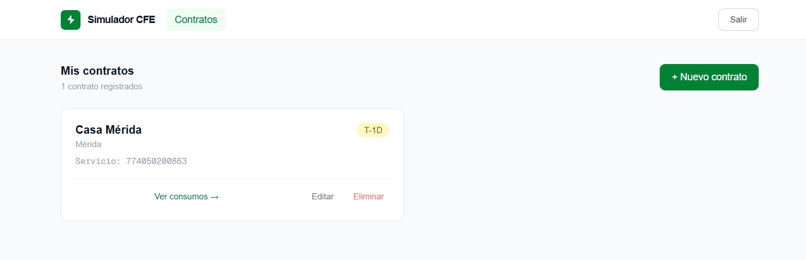
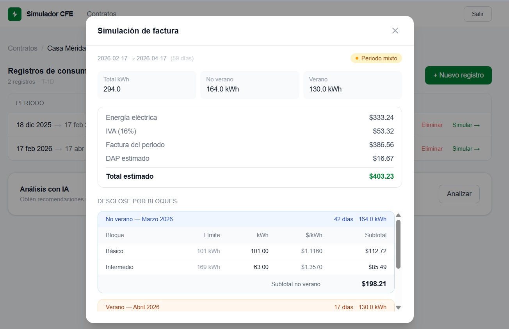
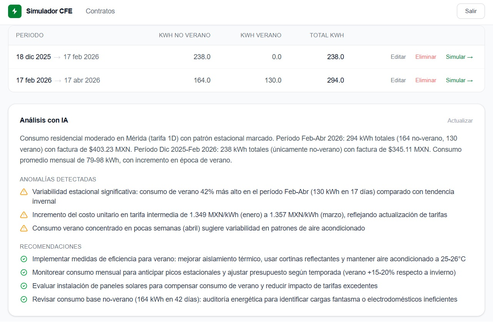

# Energy Bill Simulator — Frontend

[English](#english) · [Español](#español)

---

<a name="english"></a>
# English

A Next.js dashboard that lets users manage CFE energy contracts, log bimonthly consumption records, visualize a detailed billing simulation, and get AI-powered consumption analysis. Connects to the [Energy Bill Simulator API](../api-express/README.md).

## Screenshots







## Architecture

The project follows a feature-based structure:

- `app/` → Next.js App Router pages and layouts
- `features/` → Domain logic: API calls, hooks, schemas, and types per feature
- `components/` → Shared UI components and feature-specific presentational components
- `lib/` → Axios client with auth interceptors, token management, and query client config
- `middleware.ts` → Route protection via `refreshToken` cookie

## Tech Stack

- **Framework:** Next.js 16.2 (App Router) + React 19
- **Language:** TypeScript
- **Styling:** Tailwind CSS v4
- **Data fetching:** TanStack Query v5 + axios (with automatic refresh token retry queue)
- **Forms:** react-hook-form + Zod + @hookform/resolvers

## Features

- JWT-based session management with silent access token refresh
- Route protection via Next.js middleware
- Dashboard with a contract grid and per-contract consumption record table
- Full CRUD for energy contracts and consumption records
- Billing simulation modal with:
  - Summer / non-summer / mixed period badge
  - Block-based pricing breakdown (Básico / Intermedio / Excedente)
  - IVA (16%) and DAP estimation
  - Prices displayed to 4 decimal places
- AI-powered consumption analysis with seasonal anomaly detection and energy-saving recommendations

## Screens

| Route | Description |
|-------|-------------|
| `/login` | Login form with validation |
| `/register` | Registration form with validation |
| `/dashboard` | Contract grid — create, edit, delete contracts |
| `/dashboard/contracts/[id]` | Consumption records table, billing simulation modal, and AI analysis panel |

## Getting Started

### Prerequisites

- Node.js 18+
- [Energy Bill Simulator API](../api-express/README.md) running on `http://localhost:3001`

### Installation

```bash
git clone <repo-url>
cd simulate-cfe-contracts
npm install
```

### Environment variables

Create a `.env.local` file at the project root:

```env
NEXT_PUBLIC_API_URL=http://localhost:3001
```

### Run

```bash
npm run dev
```

The app will be available at `http://localhost:3000`.

## Live Demo

[https://cfe-contracts-production.up.railway.app](https://cfe-contracts-production.up.railway.app)

## Project Status

Frontend is complete and deployed.

---

<a name="español"></a>
# Español

Dashboard en Next.js que permite gestionar contratos de energía CFE, registrar consumos bimestrales, visualizar una simulación detallada de la factura y obtener análisis de consumo con IA. Se conecta a la [API del Simulador de Facturas](../api-express/README.md).

## Capturas de pantalla


## Arquitectura

El proyecto sigue una estructura basada en features:

- `app/` → Páginas y layouts con App Router de Next.js
- `features/` → Lógica de dominio: llamadas a la API, hooks, schemas y tipos por feature
- `components/` → Componentes UI compartidos y componentes de presentación por feature
- `lib/` → Cliente axios con interceptores de auth, gestión de tokens y configuración del query client
- `middleware.ts` → Protección de rutas mediante cookie `refreshToken`

## Stack tecnológico

- **Framework:** Next.js 16.2 (App Router) + React 19
- **Lenguaje:** TypeScript
- **Estilos:** Tailwind CSS v4
- **Fetching:** TanStack Query v5 + axios (con cola de reintentos para refresh automático)
- **Formularios:** react-hook-form + Zod + @hookform/resolvers

## Funcionalidades

- Gestión de sesión JWT con refresco silencioso del access token
- Protección de rutas mediante middleware de Next.js
- Dashboard con grid de contratos y tabla de registros de consumo por contrato
- CRUD completo de contratos de energía y registros de consumo
- Modal de simulación de factura con:
  - Badge de periodo verano / no-verano / mixto
  - Desglose por bloques tarifarios (Básico / Intermedio / Excedente)
  - Estimación de IVA (16%) y DAP
  - Precios mostrados a 4 decimales
- Análisis de consumo con IA: detección de anomalías estacionales y recomendaciones de ahorro energético

## Pantallas

| Ruta | Descripción |
|------|-------------|
| `/login` | Formulario de inicio de sesión con validación |
| `/register` | Formulario de registro con validación |
| `/dashboard` | Grid de contratos — crear, editar, eliminar contratos |
| `/dashboard/contracts/[id]` | Tabla de registros, modal de simulación de factura y panel de análisis con IA |

## Instalación

### Requisitos

- Node.js 18+
- [API del Simulador de Facturas](../api-express/README.md) corriendo en `http://localhost:3001`

### Pasos

```bash
git clone <url-del-repo>
cd simulate-cfe-contracts
npm install
```

### Variables de entorno

Crea un archivo `.env.local` en la raíz del proyecto:

```env
NEXT_PUBLIC_API_URL=http://localhost:3001
```

### Ejecutar

```bash
npm run dev
```

La app estará disponible en `http://localhost:3000`.

## Demo en vivo

[https://cfe-contracts-production.up.railway.app](https://cfe-contracts-production.up.railway.app)

## Estado del proyecto

El frontend está completo y desplegado.
